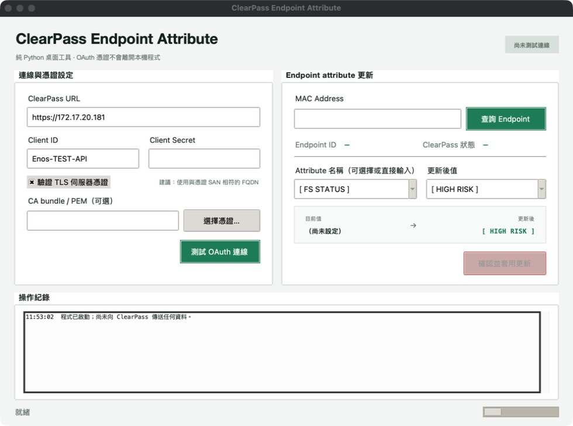

# ClearPass Endpoint Attribute 更新工具

這是完全以 Python 撰寫的本機桌面程式，介面使用 Python 內建的 Tkinter；不會啟動 Web server，也沒有 HTML、CSS 或 JavaScript。

功能：

- 以 MAC Address 查詢 Aruba ClearPass Endpoint。
- ClearPass 連線欄位只需輸入 IP 或 FQDN，程式固定使用 HTTPS。
- 按下查詢時會先驗證 OAuth；認證成功後才送出 Endpoint 查詢。
- Attribute 名稱下拉選單固定提供 `[ FS STATUS ]`，並合併 Endpoint 的既有 attribute；也可直接輸入其他名稱。
- 更新值限制為 `[ UNKNOWN ]` 與 `[ HIGH RISK ]`，預設選取 `[ HIGH RISK ]`。
- 更新前顯示 MAC、attribute、目前值與新值供確認。
- 合併原有 attributes 後 PATCH，並再次 GET 驗證寫入結果。
- OAuth token 只存在 Python 程序記憶體，不會顯示在畫面或寫入檔案。

## GUI 畫面

下圖為程式啟動後的完整桌面介面；Client Secret 欄位在畫面中保持空白或以圓點遮蔽，不會顯示明文。



## 快速啟動

需求：Python 3.10 以上，並包含 Tk 8.6 以上。

```bash
python3 -m venv .venv
source .venv/bin/activate
pip install -r requirements.txt
cp .env.example .env
python app.py
```

`python app.py` 會直接開啟桌面視窗，不會使用瀏覽器。

## 操作流程

1. 輸入或確認 ClearPass IP / FQDN、Client ID、Client Secret 與 TLS 設定；`https://` 由程式固定提供。
2. 輸入 MAC Address 後按下「查詢 Endpoint」。
3. 程式先呼叫 OAuth；只有認證成功才會送出 Endpoint 查詢，因此不必預先按「測試 OAuth 連線」。
4. 查詢成功後，Attribute 名稱預設為 `[ FS STATUS ]`；下拉選單也會包含該 Endpoint 已存在的其他 attributes。
5. 選擇 `[ UNKNOWN ]` 或 `[ HIGH RISK ]`，確認畫面顯示的目前值與更新後值。
6. 按下「確認並套用更新」，再次確認後才會寫入 ClearPass。
7. 程式在 PATCH 後重新 GET；只有重新查詢的值一致才會顯示更新成功。

「測試 OAuth 連線」只驗證憑證與 TLS，不會查詢或修改任何 Endpoint。

## 設定與 OAuth 憑證

視窗內可直接輸入：

- ClearPass IP / FQDN（不需輸入 `https://`）
- Client ID
- Client Secret（以圓點遮蔽）

Client ID 與 Client Secret 的建立及取得方式，可由 GUI 的「取得資訊說明」開啟 [Aruba 官方文件](https://developer.arubanetworks.com/cppm/v6.12.7/docs/getting-started-with-the-clearpass-policy-manager-api)。

也可在 `.env` 預先設定：

```dotenv
CLEARPASS_BASE_URL=https://172.17.20.181
CLEARPASS_CLIENT_ID=Enos-TEST-API
CLEARPASS_CLIENT_SECRET=請填入實際密鑰
CLEARPASS_VERIFY_TLS=true
CLEARPASS_CA_BUNDLE=
CLEARPASS_TIMEOUT_SECONDS=15
CLEARPASS_ATTRIBUTE_NAME=[ FS STATUS ]
```

| 環境變數 | 預設值 | 用途 |
| --- | --- | --- |
| `CLEARPASS_BASE_URL` | `https://172.17.20.181` | ClearPass scheme、host 與選填 port |
| `CLEARPASS_CLIENT_ID` | `Enos-TEST-API` | OAuth API Client ID |
| `CLEARPASS_CLIENT_SECRET` | 無 | OAuth Client Secret；必填且屬敏感資訊 |
| `CLEARPASS_VERIFY_TLS` | `true` | 是否驗證伺服器憑證 |
| `CLEARPASS_CA_BUNDLE` | 空白 | 內部 CA 或 self-signed 憑證的 PEM 絕對路徑 |
| `CLEARPASS_TIMEOUT_SECONDS` | `15` | 單次 HTTP 請求逾時，允許 1–120 秒 |
| `CLEARPASS_ATTRIBUTE_NAME` | `[ FS STATUS ]` | 固定首選 Attribute 名稱 |

`.env` 不會覆蓋作業系統已存在的同名環境變數。程式也不會把視窗中輸入的 secret 寫回磁碟；若使用 `.env`，請妥善保護該檔案。`.env` 已列入 `.gitignore`。

ClearPass API Client 應使用 `Client credentials` Grant Type。程式固定向 `/api/oauth` 傳送 `grant_type=client_credentials`，不使用管理者帳號密碼。[取得資訊說明](https://developer.arubanetworks.com/cppm/v6.12.7/docs/getting-started-with-the-clearpass-policy-manager-api)

## TLS 伺服器憑證

程式預設啟用嚴格 TLS 驗證：

1. 若 ClearPass 使用公開或系統已信任的 CA，保持「驗證 TLS 伺服器憑證」勾選即可。
2. 若使用公司內部 CA，請在視窗選擇 CA bundle / PEM，或設定 `CLEARPASS_CA_BUNDLE`。
3. ClearPass IP / FQDN 最好使用憑證 SAN 內的 FQDN。若使用 `172.17.20.181`，但憑證只有 DNS hostname，仍會因 hostname mismatch 驗證失敗。
4. 測試環境可取消 TLS 驗證，但程式會在第一次連線前再次顯示安全警告；正式環境不建議停用。

`.env` 範例：

```dotenv
CLEARPASS_VERIFY_TLS=true
CLEARPASS_CA_BUNDLE=/absolute/path/to/company-clearpass-ca.pem
```

GUI 固定使用 HTTPS，不提供切換 HTTP 的選項；底層設定層也會拒絕將 OAuth secret 傳送到遠端的純 HTTP URL。

### 目前 ClearPass 憑證檢查（2026-07-29）

對 `172.17.20.181:443` 執行未傳送 OAuth 憑證的只讀 TLS 握手後確認：

- Subject / Issuer：`O=PolicyManager, CN=CPPM1720181`（self-signed）
- Subject Alternative Name：`172.17.20.181`
- 有效期間：2026-04-21 至 2027-04-21（UTC）
- SHA-256：`C3:6A:5E:FF:EF:5D:B8:24:28:14:5A:B2:57:74:4E:F8:8B:56:68:9D:F0:F5:60:7F:03:26:30:25:3F:B1:C8:AC`

目前系統信任庫不信任此 self-signed certificate；將經可信管道匯出的 PEM 指定為 CA bundle 後，Python TLS 1.3 驗證可通過。匯出後應先透過 ClearPass 管理介面或其他可信管道核對上述 fingerprint，再加入信任；不要直接信任從未驗證連線取得的憑證。

## ClearPass API 流程

1. 按下「查詢 Endpoint」後，先以 `POST /api/oauth` 和 `client_credentials` 驗證登入並取得 Bearer token。
2. 只有 OAuth 成功後，才以 `GET /api/endpoint/mac-address/{mac_address}` 取得 Endpoint 與 numeric id；若 OAuth 失敗，流程立即停止。
3. `PATCH /api/endpoint/{endpoint_id}`，更新合併後的 `attributes` object。
4. 再次 GET Endpoint，確認目標值已寫入。

官方參考：[OAuth token endpoint](https://developer.arubanetworks.com/cppm/reference/tokenendpointpost)、[依 MAC 讀取 Endpoint](https://developer.arubanetworks.com/cppm/reference/endpointmac-addressbymac_addressget)、[依 Endpoint ID 更新欄位](https://developer.arubanetworks.com/cppm/reference/endpointbyendpoint_idpatch)。

## 代碼結構

```text
.
├── app.py                         # 程式入口，只負責啟動 GUI
├── clearpass_tool/
│   ├── __init__.py                # 套件公開介面
│   ├── client.py                  # OAuth、HTTP、Endpoint GET/PATCH 與寫入驗證
│   ├── config.py                  # .env、預設值、URL/TLS 設定正規化
│   ├── gui.py                     # Tkinter 元件、狀態、背景工作與操作流程
│   └── validation.py              # MAC、Attribute 名稱與值的輸入驗證
├── tests/
│   ├── test_client.py             # 模擬 ClearPass HTTP 回應的 client 測試
│   ├── test_config.py             # 設定與 TLS 安全規則測試
│   ├── test_documentation.py      # 所有 Python 功能 docstring 覆蓋檢查
│   ├── test_gui.py                # 不開啟視窗的 GUI 流程測試
│   └── test_validation.py         # 輸入正規化與白名單測試
├── .env.example                   # 不含真實 secret 的設定範本
├── requirements.txt               # 執行期第三方套件，目前只有 requests
└── README.md                       # 操作、架構、安全與維護文件
```

### 模組責任與依賴方向

| 模組 | 責任 | 不應負責的內容 |
| --- | --- | --- |
| `app.py` | 呼叫 `run_app()` | 商業邏輯、HTTP 或設定解析 |
| `gui.py` | 畫面、操作順序、主執行緒與背景執行緒協調 | 直接組裝 HTTP 請求 |
| `client.py` | 唯一的 ClearPass 網路邊界、Token 快取、GET/PATCH、回寫驗證 | Tkinter 元件或對話框 |
| `config.py` | 設定來源、預設值及安全正規化 | 發送網路請求 |
| `validation.py` | 純輸入驗證與 MAC 正規化 | GUI 狀態或網路存取 |
| `tests/` | 離線驗證上述行為 | 使用真實 ClearPass 或真實憑證 |

依賴方向如下，維護時應避免反向依賴：

```text
app.py
  └─ gui.py
      ├─ config.py
      ├─ validation.py
      └─ client.py ── requests ── ClearPass API
```

### 執行時狀態與執行緒

- Tkinter 元件只能由主執行緒操作。
- OAuth、GET 與 PATCH 都透過 `_run_async()` 在背景 daemon 執行緒執行，避免視窗凍結。
- 背景執行緒只把結果或例外放入 `result_queue`；`_poll_results()` 在 Tk 主執行緒取出並更新畫面。
- `ClearPassClient` 以 lock 保護 Token 更新，避免多個工作同時重複取得 Token。
- Token 只保存在 `_AccessToken` 記憶體物件，並在官方到期時間前預留最多 60 秒安全緩衝。
- API 回應 401 時只清除 Token 並重新認證一次，防止無限重試。

### Endpoint 更新策略

ClearPass PATCH 的 `attributes` 是完整物件。本工具先讀取現有 attributes，複製後只改目標 key，再送出合併後的物件，避免刪除其他自訂資料。如果值本來就相同，程式會跳過 PATCH。PATCH 完成後重新查詢，若目標 attribute 未等於指定值則視為失敗。

## 常見錯誤排查

| 訊息／狀況 | 優先檢查項目 |
| --- | --- |
| `The client credentials are invalid` | API Client 是否啟用、Grant Type 是否為 `Client credentials`、Client ID 大小寫及最新 Client Secret |
| TLS 憑證驗證失敗 | URL 是否符合憑證 SAN、是否選擇正確 CA bundle、憑證是否過期 |
| HTTP 403 | API Client 的 Operator Profile 是否具有 Endpoint 讀取／更新權限 |
| 找不到 MAC Address | MAC 是否正確、Endpoint 是否已存在於 ClearPass |
| 更新後重新查詢不一致 | ClearPass 是否有規則覆寫值、API 權限或 payload schema 是否變更 |

OAuth 失敗時流程會停在「查詢前 OAuth 驗證」，不會繼續呼叫 Endpoint API。Endpoint 404 或 403 不會被誤標為 OAuth 失敗。

## 後續維護指引

- 修改預設 Attribute 名稱：調整 `clearpass_tool/config.py` 的 `DEFAULT_ATTRIBUTE_NAME`。
- 修改可選狀態值：調整 `ATTRIBUTE_VALUES` 與 `DEFAULT_ATTRIBUTE_VALUE`，並同步更新相關測試及本文件。
- 修改 API endpoint、認證或 payload：集中在 `clearpass_tool/client.py`，不要在 GUI 內直接呼叫 `requests`。
- 增加 GUI 行為：在 `clearpass_tool/gui.py` 保持網路工作走 `_run_async()`，callback 回到主執行緒後再操作 Tk 元件。
- 所有 Python 模組、類別與函式都必須保留功能 docstring；非直觀的安全、資料保留及執行緒決策應使用行內註解說明原因。
- 新功能必須新增離線測試，測試不得依賴實際 ClearPass、真實 Client Secret 或內網連線。

## 測試

```bash
python3 -m compileall -q app.py clearpass_tool tests
python3 -m unittest discover -s tests -v
```

測試使用模擬的 HTTP 回應，不會連線或修改實際 ClearPass。`test_documentation.py` 會解析所有 Python AST；新增模組、類別或函式若缺少 docstring，完整測試會直接失敗。
